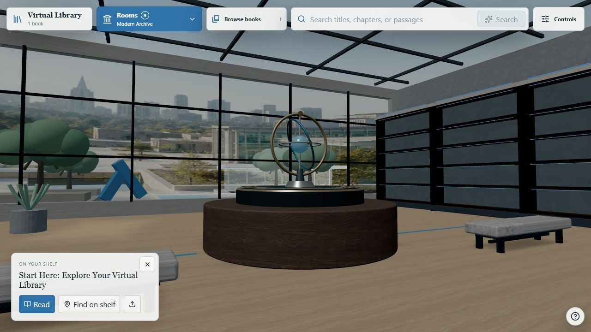
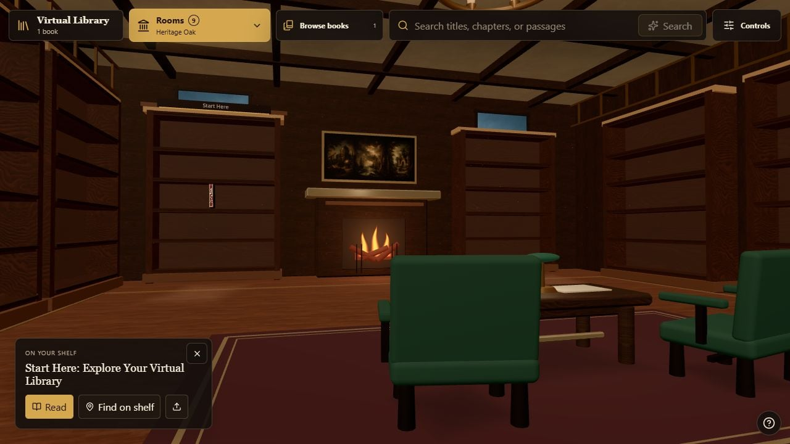
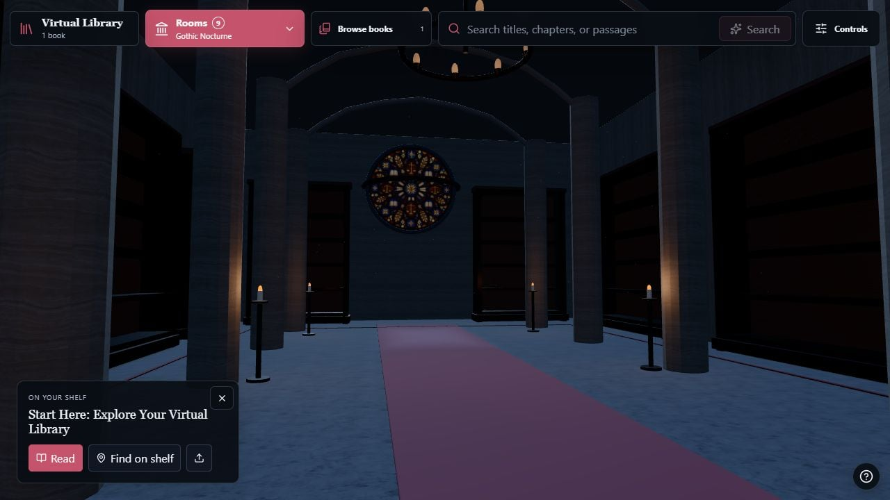
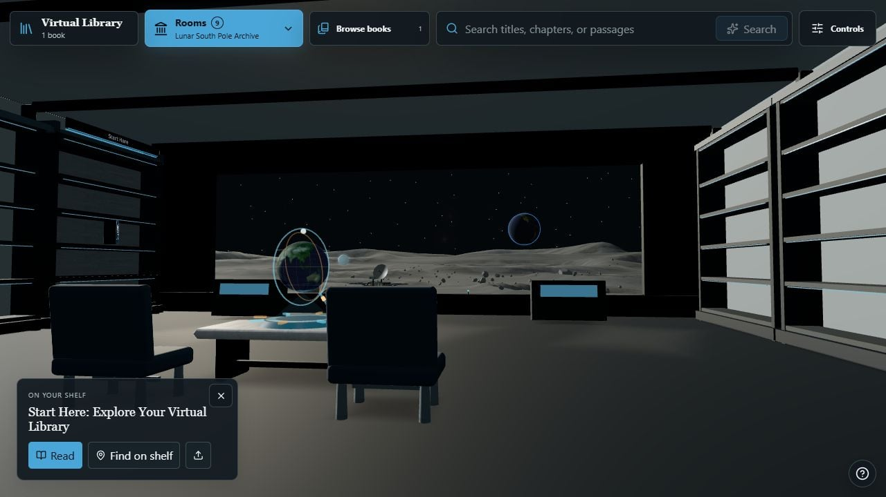
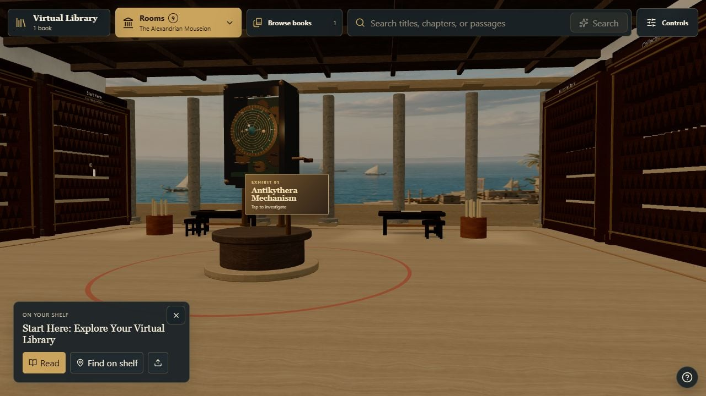
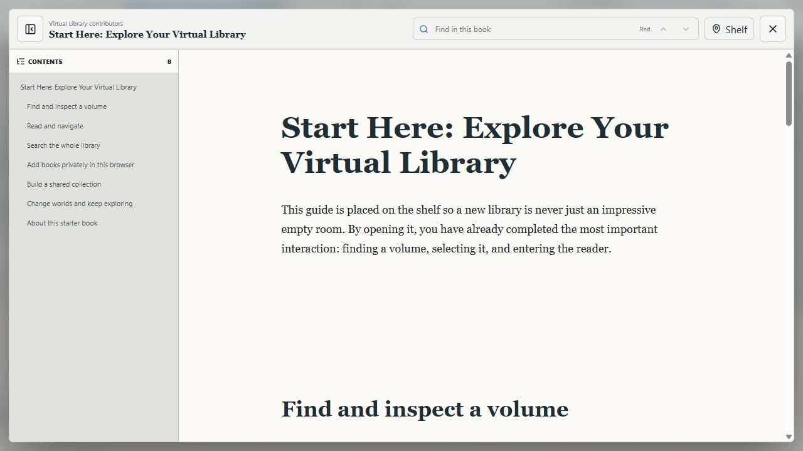

# Virtual Library

### Your Markdown collection, nine worlds to explore

Turn books, essays, research notes, or documentation into a searchable 3D library. Walk between shelves, discover a passage, and settle into the built-in reader. Virtual Library is content-neutral, runs in your browser, and can be hosted as a static website.

**[Try the live library](https://virtual-library.codefactory.synology.me/)** · [Explore the rooms](#nine-rooms-one-collection) · [Controls](#walking-and-reading) · [Add books](#bring-your-own-books) · [Run locally](#run-locally) · [Self-host](#host-your-own-library)

[](docs/images/modern.jpg)

*Modern Archive, with the neutral Start Here guide. Screenshots show the running application at its default Auto quality.*

## A library you can walk through

- **Explore nine rooms:** reading halls, a cathedral archive, a lunar habitat, and more, each with its own architecture, furnishings, lighting, and optional ambience.
- **Bring your own Markdown:** import files privately into your browser or build a shared collection into your own site.
- **Find a book or a passage:** browse by author, category, and tag, or search titles, headings, and full text.
- **Read without leaving the room:** open a book with a table of contents, in-book search, and remembered reading progress.
- **Make the shelves yours:** rename shelves, move books, and return to automatic organization whenever you like.
- **Run it yourself:** no account, API key, database, or application backend is required.

### Start with a two-minute visit

1. Open the [live demo](https://virtual-library.codefactory.synology.me/) and choose **Read** to open the bundled **Start Here** guide.
2. Close the reader and select **Rooms** to visit another world. Your collection follows you.
3. Open **Controls → Add & manage books → Add Markdown files**, or drop a `.md` file onto the application. It appears on your shelves and in search.

The reference demo is provided on a best-effort basis. Browser imports stay on your device; they are not uploaded to the demo server.

## Nine rooms, one collection

| Heritage Oak | Gothic Nocturne |
| --- | --- |
| [](docs/images/heritage.jpg) | [](docs/images/gothic.jpg) |
| Warm wood, fireside seating, and a Georgian reading hall. | A cathedral archive with stone vaults and cool night lighting. |

| Lunar South Pole Archive | The Alexandrian Mouseion |
| --- | --- |
| [](docs/images/lunar.jpg) | [](docs/images/alexandria.jpg) |
| A research habitat overlooking the Moon's south pole. | A Ptolemaic research sanctuary where books become scrolls. |

The full World Atlas includes:

| Room | Setting |
| --- | --- |
| **Modern Archive** | A museum archive with garden views |
| **Heritage Oak** | A Georgian reading hall |
| **Gothic Nocturne** | A cathedral archive |
| **Renaissance Scriptorium** | An Italian cloister and garden loggia |
| **Art Deco Athenaeum** | A metropolitan penthouse |
| **Neon Foundry** | An industrial archive with animated machinery |
| **Lunar South Pole Archive** | A lunar research habitat |
| **Arkship Memory Gallery** | An interstellar passenger archive |
| **The Alexandrian Mouseion** | A classical research sanctuary |

Select any screenshot to open it at full size. [Screenshot notes](docs/images/README.md) describe the capture conditions. Room choice is remembered in your browser; links such as `/?world=alexandria` open a particular room.

## Walking and reading

### Desktop controls

Start by dragging to look and using the keyboard to walk. For mouse-look navigation, choose **Controls → Explore with mouse & keyboard**. This captures the pointer until you press `Escape`.

| Input | Action |
| --- | --- |
| Drag, or move the mouse in immersive mode | Look around |
| `WASD` or arrow keys | Walk |
| `Shift` while moving | Sprint |
| `Ctrl` | Crouch |
| `Space` | Jump |
| Click a book or scroll | Inspect it, then choose **Read** |
| `E` in immersive mode | Inspect the volume under the reticle |
| `Ctrl+K` / `Cmd+K` | Open search; while reading, search within the book |
| `Escape` | Close the active panel or leave immersive mode |

**Find on shelf** helps locate a selected book. The question-mark button opens the movement guide, and **Controls** includes a return-to-entrance action.

### Touch, comfort, and display

On a phone or tablet, drag to look, use the on-screen pad to walk, tap **Jump**, and tap a book to inspect it. Use **Browse books** to find titles without walking to each shelf.

Under **Controls → Brightness, quality & motion**, adjust brightness, choose Auto/Lite/Balanced/Cinematic quality, pause room motion, or explore with fewer controls. Ambience is optional and pauses while reading or when the tab is hidden. Auto uses compact room models; Cinematic downloads additional detail and uses more power and data.

### Search and the reader

Search finds titles, authors, headings, and passages across your shared and browser-imported books. Open a result to read, navigate by chapter in the table of contents, or search inside the book. Large documents are processed in a worker and displayed section by section.

[](docs/images/reader.jpg)

## Bring your own books

### Import into your browser

1. Open **Controls → Add & manage books**.
2. Choose **Add Markdown files** and select one or more `.md` files, or drag them onto the application.
3. Browse or search the imported books immediately. Use **Manage books** to remove them or **Organize shelves** to rename shelves and move books.

Each import accepts up to **500 files**, **24 MiB per file**, and **128 MiB total**. Only Markdown is ingested directly. For PDF or EPUB material, convert it to Markdown first and review the result before importing. The interface also links to a separate PDF conversion tool.

Files are stored in IndexedDB for that browser profile and site origin. Reloading preserves them, but clearing site data removes them. They do not synchronize across devices, browsers, hostnames, or ports. Keep your original files: there is no browser-library export or cloud backup.

### Build a shared collection

Place Markdown files under `books/`, then run `pnpm dev` or `pnpm build`. Subfolders are scanned automatically.

```text
books/
├── essays/
│   └── a-short-essay.md
└── field-notes.md
```

The build creates the catalogue, search index, shelves, and downloadable Markdown sources. Everyone who can access your deployed site can retrieve this shared collection. Rebuild after changing its files.

The repository starts with an empty `books/` folder and one neutral guide from `examples/`. Adding a shared book replaces that fallback. Browser visitors can also choose **Remove starter book** and later **Restore starter book** without changing the shared site.

### Give books useful metadata

A first-level heading is enough for a title. Optional YAML frontmatter gives you predictable authors, categories, tags, and shelf grouping:

```markdown
---
title: Field Notes
author: Example Author
year: 2026
categories: [Nature, Essays]
tags: [Observation]
collection: Fieldwork
summary: Notes on observing the natural world through the seasons.
---

# Field Notes

## First observations

Your text begins here.
```

Books are grouped by collection, falling back to author. Headings become reader sections and search locations. See [Adding and organizing books](docs/books.md) for metadata aliases, automatic shelving, import limits, and using `LIBRARY_CONTENT_ROOT` to keep shared books outside the repository.

## Run locally

You need **Node.js 22.12 or later**, **pnpm 11.16.0** (pinned in `package.json`), **Git LFS**, and a modern WebGL-capable browser. Blender is optional; the runtime artwork is already included.

```bash
git lfs install
git clone https://github.com/mabijaoude/virtual-library.git
cd virtual-library
git lfs pull
corepack enable
pnpm install --frozen-lockfile
pnpm dev
```

Open [localhost on port 5173](http://127.0.0.1:5173). Use a Git clone with LFS instead of assuming a source ZIP includes the large artwork files. No credentials or `.env` file are needed.

### Verify a change

```bash
pnpm verify
pnpm audit --audit-level high
```

`pnpm verify` checks release documents, image assets, dependency notices, tracked-file privacy, and Git LFS integrity; runs the tests; builds the application; and enforces performance budgets. GitHub Actions runs these checks and builds the Docker image.

| Command | Purpose |
| --- | --- |
| `pnpm dev` | Prepare books and start the local development server |
| `pnpm test` | Run application, ingestion, and asset-contract tests |
| `pnpm build` | Prepare books, type-check, and create `dist/` |
| `pnpm perf:budget` | Check the built bundle, catalogue, and room sizes |
| `pnpm check:privacy` | Scan source files and materialized assets for private paths and common secrets |
| `pnpm check:history` | Audit all local Git refs and their available LFS payloads before publication |
| `pnpm preview` | Preview the production build locally |

### How it stays responsive

The catalogue and interface load before the heavier 3D scene. Room models, the reader, and search load progressively. Workers handle search, document parsing, and book-label generation, while room and reader caches stay bounded.

Automated budgets limit the catalogue shell to **190 KB gzip**, the scene bootstrap to **450 KB gzip**, and each compact room model to **2 MiB**. These are transfer-size limits, not frame-rate guarantees. See [Performance](docs/performance.md) for all budgets and a repeatable profiling procedure, and [Release review](docs/release-readiness.md) for this snapshot's results and remaining checks.

## Host your own library

`pnpm build` produces a complete static site in `dist/`. Serve it at the root of an HTTP(S) site with a stable hostname. No running Node.js backend is needed.

For Docker Compose:

```bash
docker compose up -d --build
```

Open [localhost on port 5587](http://localhost:5587). The image serves the compiled library through Nginx. Rebuild the image when shared books change; browser imports remain in visitors' browsers.

See [Self-hosting](docs/self-hosting.md) for custom ports, external collections, static hosting, HTTPS, and caching. Review your shared books before publishing: their source text is included in the site.

## Inside the project

The application uses **React, TypeScript, Vite, Three.js, React Three Fiber, and Drei**. Markdown is parsed with **marked** and sanitized with **DOMPurify**; **MiniSearch** provides local full-text search. Assets use GLB, WebP, KTX2, and HDR, with scripted Blender generation and glTF Transform processing.

| Directory | Contents |
| --- | --- |
| `src/components/` | Navigation, catalogue, reader, and scene interface |
| `src/worlds/` | Nine rooms, furnishings, collision, and lighting |
| `src/editions/` | Branding and content/search provider configuration |
| `scripts/` | Markdown preparation, asset tools, and release checks |
| `public/worlds/` | Runtime models, textures, environments, and previews |
| `art-source/` | Source artwork and provenance; generated Blender files stay local |
| `examples/` | The neutral Start Here guide |
| `books/` | Your shared Markdown collection, ignored by Git |

For scene changes, follow [Scene development](docs/scene-development.md). For a custom edition, see [Forking](FORKING.md) and the [upstream workflow](docs/upstream-workflow.md).

## Privacy, accessibility, and limits

The clean application has no account system, analytics integration, or server-side upload endpoint. App assets are bundled locally. Your hosting provider can retain access logs, and Markdown may include external links or images that contact other sites.

Keyboard controls, modal focus handling, touch navigation, and reduced-motion support are included. The 3D rooms are a visual WebGL experience and do not provide equivalent screen-reader navigation. Real-device and assistive-technology coverage remains limited.

This project focuses on Markdown and static hosting. It has no built-in PDF/EPUB ingestion, OCR, cross-device sync, or live shared-library updates without rebuilding. Browser storage can be cleared or evicted, so retain your source documents.

## Forking and licenses

Virtual Library is offered for independent forks and modification. Use [GitHub Issues](https://github.com/mabijaoude/virtual-library/issues) to report bugs or suggest features. Individual support and implementation timelines are not guaranteed, and the upstream does not accept pull requests. [FORKING.md](FORKING.md) explains the maintenance workflow; [SECURITY.md](SECURITY.md) explains how to report sensitive findings privately.

Software is licensed under **[MIT](LICENSE)**. Project-created visual assets use **[CC BY 4.0](LICENSE-ASSETS.md)** unless identified otherwise. Third-party assets retain the terms in [Asset provenance](ASSET_LICENSES.md), and software dependencies retain their [third-party notices](THIRD_PARTY_NOTICES.md). These notices are also included in the built site.

The `private: true` package flag prevents accidental npm publication. It does not restrict the software's MIT license or require a private service.
